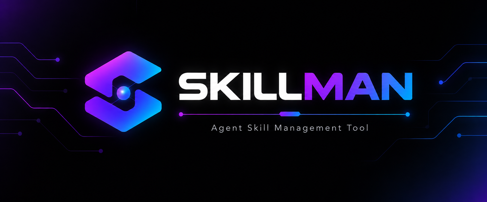
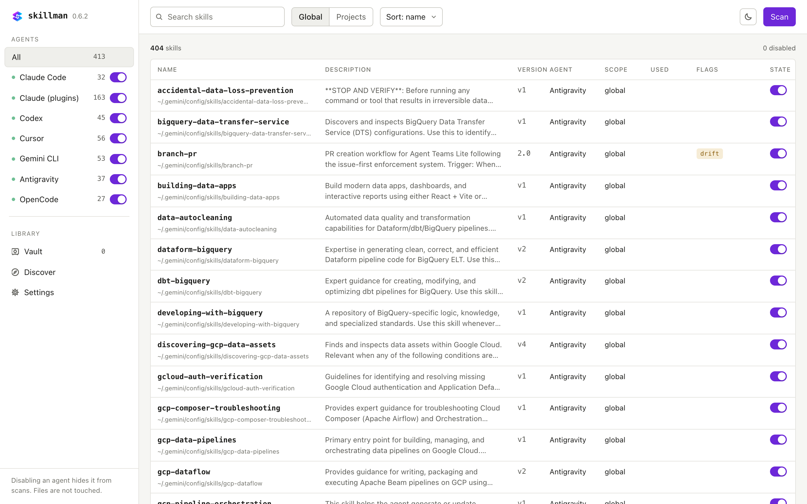
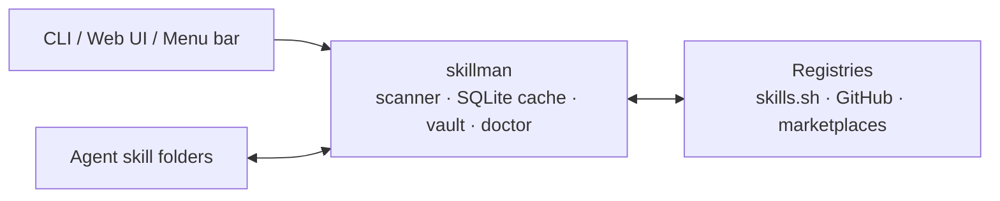

<a id="top"></a>
<div align="center">

<h1>skillman</h1>
<p><strong>One place to see, switch and share the skills of every AI coding agent on your machine.</strong></p>
<p>
<a href="https://github.com/melvicsosa/skillman/releases"></a>
<a href="LICENSE"></a>


</p>
</div>

<div align="center"></div>

### Quick start

```sh
brew install melvicsosa/tap/skillman   # 1. install
skillman scan                          # 2. discover the skills on disk
skillman serve                         # 3. open the UI on http://localhost:3010
```

<p align="center"></p>

<details>
<summary><b>Table of contents</b></summary>

- [What is skillman?](#what-is-skillman)
- [What you get](#what-you-get)
- [Which agents it works with](#which-agents-it-works-with)
- [Install](#install)
- [How it works](#how-it-works)
- [Everyday commands](#everyday-commands)
- [Keeping it running](#keeping-it-running)
- [Development](#development)
- [License](#license)

</details>

<div align="center"></div>

## What is skillman?

Every AI coding agent keeps its own skills folder. None of them can switch a single skill off, and copies of the same skill drift apart across agents. skillman is one Go binary that finds every skill on your machine, lets you enable or disable each one per agent, keeps one copy in a vault, and serves a local UI.

<table>
<tr>
<td width="50%" valign="top"><b>Before</b><br><br><i>"I have the same skill in four folders, one of them is outdated, and the only way to turn one off is to delete it."</i></td>
<td width="50%" valign="top"><b>After</b><br><br><i>One list of every skill per agent, a switch for each one, a single vault copy linked into every agent, and a doctor that tells you when copies drift.</i></td>
</tr>
</table>

### Who it's for

- Developers who run **more than one AI coding agent** and want the same skills everywhere.
- Anyone who wants to **turn a skill off without deleting it**, per agent or per project.
- Teams that publish skills and want to **pull them from skills.sh, GitHub or Claude marketplaces** in one step.

### What it is not

> [!IMPORTANT]
> skillman **never installs an agent** and **never deletes skill files**. Disabling a skill moves its folder to a quarantine directory inside `~/.skillman`; enabling it moves the folder back.

<div align="right"><a href="#top">Back to top</a></div>

<div align="center"></div>

## What you get

<table>
<tr>
<td width="50%" valign="top"><b>Skills</b><br>Lists skills per agent, globally or per project; disable moves a skill to quarantine and enable moves it back.</td>
<td width="50%" valign="top"><b>Vault</b><br>Downloaded skills live once in <code>~/.skillman/vault/&lt;name&gt;</code> and are symlinked (or copied) into agents.</td>
</tr>
<tr>
<td valign="top"><b>Discover</b><br>Searches skills.sh, GitHub and Claude plugin marketplaces; adds skills by reference, URL or local path.</td>
<td valign="top"><b>Doctor and drift</b><br>Reports spec issues, broken vault links and copies of the same skill that differ; repairs drift from a chosen source.</td>
</tr>
<tr>
<td valign="top"><b>Sync</b><br>Fans vault entries out to every enabled, writable agent; per-entry auto-sync runs on each scan.</td>
<td valign="top"><b>Export as Claude plugin</b><br>Writes a <code>.claude-plugin/plugin.json</code> plus <code>skills/</code> directory from selected vault skills.</td>
</tr>
<tr>
<td valign="top"><b>Settings and service</b><br>Port, registry tokens, marketplace list, and a launchd login service on macOS.</td>
<td valign="top"><b>Menu bar app</b><br>Shows the server state, opens the UI, starts, stops and restarts the server, and manages launch at login.</td>
</tr>
</table>

<div align="right"><a href="#top">Back to top</a></div>

<div align="center"></div>

## Which agents it works with

| Agent | Global skills folder |
| --- | --- |
| **Claude Code** | `~/.claude/skills` |
| **Claude plugins** | `~/.claude/plugins/cache` |
| **Codex** | `~/.agents/skills` |
| **Cursor** | `~/.cursor/skills` |
| **Gemini CLI** | `~/.gemini/skills` |
| **Antigravity** | `~/.gemini/config/skills` |
| **OpenCode** | `~/.config/opencode/skills` |

> [!NOTE]
> The Claude plugin cache is **read-only**: skillman lists those skills but never installs into, syncs to, or moves anything there.
> Every global and project path per agent: **[Agents](docs/agents.md)**.

<div align="right"><a href="#top">Back to top</a></div>

<div align="center"></div>

## Install

```sh
brew install melvicsosa/tap/skillman                              # Homebrew, macOS and Linux
go install github.com/melvicsosa/skillman/cmd/skillman@latest    # from source, Go 1.26+
skillman version                                                 # expected: prints a version number
```

| Platform | CLI and `serve` | `service` | Menu bar app |
| --- | --- | --- | --- |
| macOS | Yes | Yes (launchd LaunchAgent) | Yes (`skillman-tray`, ships with the Homebrew formula) |
| Linux | Yes (release binaries for amd64 and arm64) | No, reports unsupported | No |
| Windows | Builds from source; no release binaries | No, reports unsupported | No |

<div align="right"><a href="#top">Back to top</a></div>

<div align="center"></div>

## How it works



- **Scan** walks every agent folder and rebuilds the SQLite cache in `~/.skillman`.
- **Vault** keeps one copy of each downloaded skill and symlinks (or copies) it into agents.
- **Doctor** detects spec issues, broken links and copies that drifted apart, and can repair them.

<div align="right"><a href="#top">Back to top</a></div>

<div align="center"></div>

## Everyday commands

```sh
skillman scan                                   # rebuild the cache from disk
skillman list --agent claude-code               # skills for one agent (add --json for scripts)
skillman disable <skill> --agent codex          # move to quarantine
skillman enable  <skill> --agent codex          # move back
skillman search <query>                         # skills.sh, GitHub and marketplaces
skillman add owner/repo/path --all              # download into the vault and link into every agent
skillman vault install <name> --to cursor       # link a vault skill into one agent
skillman sync --all                             # fan vault entries out to every enabled agent
skillman doctor                                 # spec issues, broken links, drift
skillman serve                                  # web UI on http://localhost:3010
```

> Full reference, every flag and the `<ref>` formats: **[Commands](docs/commands.md)**.

<div align="right"><a href="#top">Back to top</a></div>

<div align="center"></div>

## Keeping it running

On macOS, `skillman service install` writes a launchd LaunchAgent that runs `skillman serve --no-open` at login and restarts it on failure; `service status|start|stop|restart|uninstall` manage it.
The menu bar app (`skillman tray`, installed with the Homebrew formula) shows the server state, opens the UI, starts, stops and restarts the server, switches the port, and manages its own launch-at-login item.
Logs land in `~/.skillman/logs/`. On Linux, run `skillman serve` from your own supervisor; `service` reports unsupported.

<div align="right"><a href="#top">Back to top</a></div>

<div align="center"></div>

## Development

Requirements: Go 1.26+, Node 22+, pnpm.

```sh
make web         # pnpm install and build the frontend into web/dist
make build       # ./dist/skillman (and ./dist/skillman-tray on macOS)
make build-tray  # macOS menu bar app only (needs CGO)
make test        # go test ./...
make lint        # golangci-lint if installed, otherwise go vet
make run         # go run ./cmd/skillman serve
```

The Go binary embeds `web/dist`; a placeholder `web/dist/index.html` is committed so `go build` works before the frontend is built. For frontend work run `pnpm dev` inside `web/`; API calls are proxied to `localhost:3010`. Releases are built by GoReleaser on `v*` tags and published to GitHub Releases and the `melvicsosa/homebrew-tap` tap.

<div align="right"><a href="#top">Back to top</a></div>

## License

MIT
